# CS 공부 

---

chapter1. [Computer Architecture](computer_science%2FComputer%20Architecture.md)
---

컴퓨터의 구성에 대해 알아봅시다.  
컴퓨터의 시스템은 크게 하드웨어와 소프트웨어로 나누어집니다.

- 하드웨어: 컴퓨터를 구성하는 기계적 장치
- 소프트웨어: 하드웨어의 동작을 지시하고 제어하는 명령어 집합  
 

---

